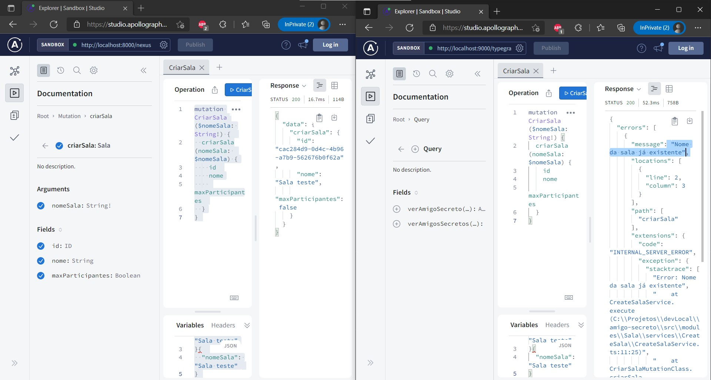

<div align="center">
  
</div>

# <div align="center"> GraphQL Amigo Secreto </div>

#### <div align="right">- Projeto Finalizado🟢 <div>

### <div align="center"> Aplicação em typescript graphql que realiza CRUD de dados referente a um jogo de amigo secreto, a aplicação aborda conceitos de: </div>

#### - DDD
#### - Apollo Server Koa
#### - GraphQL
#### - Nexus
#### - TypegraphQL
#### - Mutation
#### - Query
#### - Subscription
#### - Scalar
#### - TDD

## <div align="center"> Sumário </div>
<!--ts-->
   - [Requisitos](#<div-align="center">Requisitos</div>)
   - [Tecnologias utilizadas](#<div-align="center">Tecnologias-utilizadas</div>)

<!--te-->
## <div align="center">Requisitos</div>
Para executar a aplicação é necessário instalar algumas ferramentas tais como um editor de códigos para realizar compilação dos mesmos. Nesse projeto foi utilizado o [Visual Studio Code](https://code.visualstudio.com/), [NodeJS](https://nodejs.org/en/) para compilação do código, [Git Bash](https://gitforwindows.org/) para baixar o repositório e baixar todas as dependências necessárias.

```bash
# Baixe o repositório.
$ git clone https://github.com/Ricnaga/amigo-secreto.git

# Acesse a pasta do projeto.
$ cd amigo-secreto

# Agora que baixou e acessou o repositório, vamos começar a instalação das dependências.
$ yarn ( caso não utilize o yarn execute apenas npm -i)

# Depois de instalado todas as dependências, abra a aplicação via vscode
$ code .

# Agore execute a aplicação do via typegraphql.
$ yarn typegql (caso não utilize o yarn: npm run typegql)

# Agore execute a aplicação do via nexus.
$ yarn nexus (caso não utilize o yarn: npm run nexus)

# A aplicação iniciará na porta configurada no .env
# No navegador digite: http://localhost:PORTA/typegraphql
# No navegador digite: http://localhost:PORTA/nexus
# Na pasta examples estão todos os códigos disponíveis para executar os serviços
```

##  <div align="center">Tecnologias utilizadas</div>
- [GraphQL](https://graphql.org/)
- [Apollo Server](https://www.apollographql.com/docs/apollo-server/)
- [Typegraphql](https://typegraphql.com/)
- [Nexus](https://nexusjs.org/)
- [Jest](https://jestjs.io)


<div align="center">
<a href="https://www.linkedin.com/in/ricardo-nagatomy"></a>

Gostou? tem alguma sugestão de melhoria? por favor, entre em contato e ja aproveita e me adiciona.<br>

#
<div align="center">  </div>
